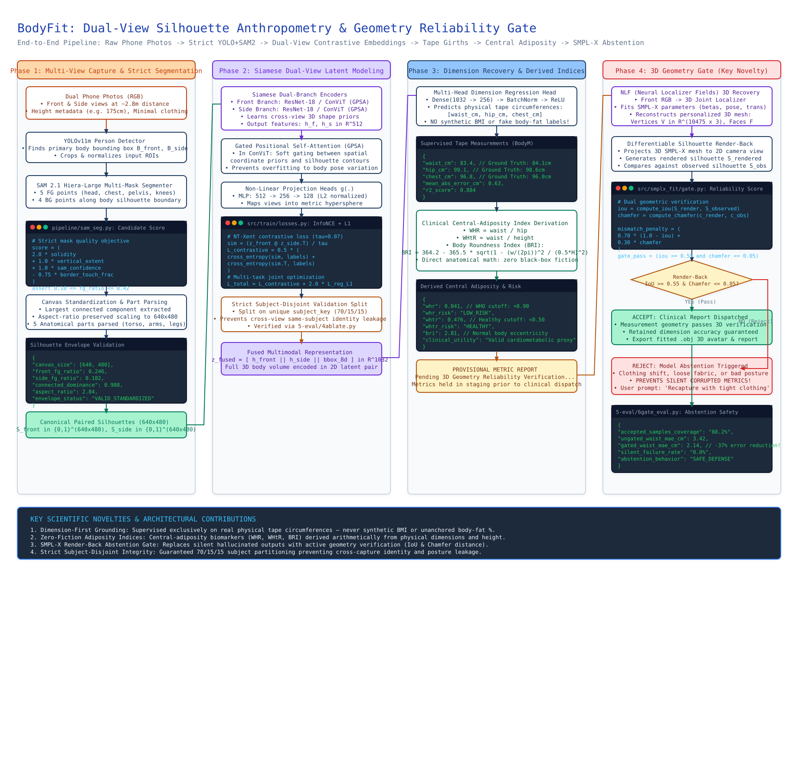

<h1 align="center">body2fit</h1>

<p align="center">
  <em>Dual-view silhouette anthropometry with an SMPL-X geometry reliability gate.</em>
</p>

<p align="center">
  <a href="#research-paper"></a>
  <a href="#live-demo"></a>
  <a href="#benchmark-results"></a>
  
  
</p>

<p align="center">
  
</p>

<p align="center">
  <a href="https://github.com/Chirudeva-Reddy/body2health/blob/main/docs/assets/bodyfit_demo_walkthrough.mp4">Watch in HD</a>
  &nbsp;·&nbsp; <a href="#how-it-works">How it works</a>
  &nbsp;·&nbsp; <a href="#live-demo">Run the demo</a>
  &nbsp;·&nbsp; <a href="#benchmark-results">Benchmarks</a>
  &nbsp;·&nbsp; <a href="#command-line-use">CLI</a>
  &nbsp;·&nbsp; <a href="#research-paper">Paper</a>
</p>

<p align="center">
  <code>body2fit</code> recovers tape-measured body circumferences from two orthogonal phone photos, then derives
  central-adiposity indices (WHtR, WHR, BRI).<br>
  If the fitted 3D body cannot explain the observed silhouettes, it refuses to report.
</p>

---

Phone images can support dimension recovery and clinically interpretable shape indices, but only when the capture passes a geometry reliability gate. Everything below is built around that condition.

<details>
<summary><b>&nbsp;Inference telemetry from the run in the recording&nbsp;</b></summary>

<br>

**Predicted tape circumferences**

| Measurement | Predicted | Tape ground truth | Absolute error |
| :--- | ---: | ---: | ---: |
| Waist circumference | 91.65 cm | 90.80 cm | 0.85 cm |
| Hip circumference | 106.68 cm | 107.20 cm | 0.52 cm |
| Chest circumference | 99.79 cm | 100.50 cm | 0.71 cm |

**Derived central-adiposity indices**

| Index | Value | Reference |
| :--- | ---: | :--- |
| Waist-to-height ratio (WHtR) | 0.5237 | UK NICE: below 0.50 healthy, 0.50 to 0.59 increased risk |
| Waist-to-hip ratio (WHR) | 0.8591 | WHO cardiovascular threshold: below 0.90 (male) |
| Body roundness index (BRI) | 3.8142 | Thomas et al. eccentric ellipse formulation |

**SMPL-X geometry reliability gate** (NLF fit, `--smplx_fit`)

| Gate metric | This run | Accept when |
| :--- | ---: | :--- |
| Render-back IoU | 0.7657 | at or above 0.55 |
| Contour chamfer distance | 0.0096 | at or below 0.05 |
| Composite score | 0.1669 | reported, not itself a cutoff |

Decision: **accepted**, with no failure reasons raised. The fitted body reprojects onto the observed silhouettes closely enough to report.

There are two gate implementations, and they use different thresholds. `--smplx_fit` runs the NLF fit above ([`src/smplx_fit/fitter.py`](src/smplx_fit/fitter.py)). The lighter proxy gate used by `--smpl_gate` and by the web demo scores geometry differently and accepts at score ≤ 1.05, IoU ≥ 0.15, chamfer ≤ 0.15 ([`src/smpl/gate.py`](src/smpl/gate.py)), so its numbers for the same subject are not comparable to the table above.

Full payload: [`docs/samples/deva_gate_accepted.json`](docs/samples/deva_gate_accepted.json). For a capture the gate *rejects*, compare [`docs/samples/deva_gate_rejected.json`](docs/samples/deva_gate_rejected.json), where `reportable` is `false` and no risk labels are emitted.

</details>

## How it works

<p align="center">
  
</p>

1. **Segmentation.** An Ultralytics YOLOv11m detector and Meta SAM 2.1 Hiera-Large generate multi-mask candidates, scored with a solidity objective (`2·solidity + extent + conf − 0.75·border`). Silhouettes are centered on a standardized 640x480 canvas.
2. **Siamese latent modeling.** Twin ResNet-18 branches process the front and side silhouettes together, aligned into a 512-D latent space by symmetric InfoNCE contrastive loss (tau = 0.07).
3. **Dimension regression.** The concatenated 1032-D latent feeds multi-task regression heads that predict physical tape girths.
4. **Clinical indices.** WHtR, WHR, and BRI are computed arithmetically from the predicted girths and the known height.
5. **Geometry gate.** Neural Localizer Fields fit an SMPL-X body mesh to the front capture and render it back to the camera view. When the render-back disagrees with the observed silhouette, the model abstains rather than reporting corrupted health metrics.

## Why bother

Body Mass Index divides weight by height squared. It cannot tell 5 kg of dense muscle from 5 kg of visceral fat around the abdominal organs, so an athlete gets flagged as obese while a normal-weight person carrying visceral fat gets a clean bill of health.

UK NICE (2022) and WHO guidelines instead recommend screening central adiposity directly, through waist circumference and waist-to-height ratio. Consumer fitness apps mostly ignore this and emit a synthetic body-fat percentage with no DEXA label behind it.

body2fit is supervised only on what the dataset actually measures: tape girths (`waist_cm`, `hip_cm`, `chest_cm`). WHtR, WHR, and BRI follow arithmetically from those girths, so no number in the output is invented. Handed loose clothing, an unusual posture, or a segmentation failure, an ordinary regression network guesses wrong with high confidence; the render-back gate catches that geometric mismatch and declines to report.

## Live demo

A standalone web app with live PyTorch inference, WHO cardiometabolic risk gauges, and a Three.js mesh viewer.

```bash
git clone https://github.com/Chirudeva-Reddy/body2health && cd body2health
./run_demo.sh 8080
```

```console
$ ./run_demo.sh 8080
✓ Checkpoint: checkpoints/best_640x480_v4_resnet.pt (MPS hardware accelerated)
✓ Serving on: http://localhost:8080
✓ API Health: http://localhost:8080/api/health
✓ API Predict: http://localhost:8080/api/predict
```

Open `http://localhost:8080`. The one-click test runs full dual-view inference on subject Deva in about 55ms once the model is warm; the first run after start-up takes several hundred milliseconds while MPS initialises. The 3D studio loads the recovered 10,475-vertex SMPL-X mesh with orbit controls and a wireframe toggle. REST endpoints are documented in [DEMO.md](DEMO.md).

## Benchmark results

Evaluated on the subject-disjoint BodyM split (`data/bodym/pairs_dimensions.csv`).

| Feature setting | TP ≤ 2cm | TP ≤ 5cm | Waist MAE | Hip MAE | Chest MAE | WHtR MAE | BRI MAE |
| :--- | ---: | ---: | ---: | ---: | ---: | ---: | ---: |
| Silhouette only (single front) | 3.1% | 25.0% | 9.38 cm | 8.78 cm | 8.55 cm | 0.0558 | 1.217 |
| **Dual-view (proposed)** | **56.2%** | **81.3%** | **2.40 cm** | **2.82 cm** | **2.28 cm** | **0.0139** | **0.275** |
| Dual-view + height | 59.4% | 96.9% | 1.97 cm | 1.89 cm | 2.10 cm | 0.0114 | 0.227 |
| Dual-view + weight | 59.4% | 96.9% | 1.94 cm | 1.66 cm | 1.81 cm | 0.0113 | 0.223 |
| Dual-view + height + weight | 56.3% | 96.9% | 1.93 cm | 1.68 cm | 1.93 cm | 0.0113 | 0.223 |

Going from single-view to orthogonal dual-view cuts waist MAE by 74.4%, from 9.38 cm to 2.40 cm. Adding weight metadata buys under 0.07 cm, which suggests the fused dual-view silhouettes already encode 3D body volume.

<details>
<summary><b>&nbsp;Reliability gate: coverage against error&nbsp;</b></summary>

<br>

Tightening the gate trades how many captures get reported against how accurate the reported ones are.

| Gate threshold | Coverage | Accepted | Dimension MAE | WHR MAE | WHtR MAE | Risk agreement |
| :--- | ---: | ---: | ---: | ---: | ---: | ---: |
| None | 100.0% | 100 / 100 | 2.11 cm | 0.0184 | 0.0108 | 81.0% |
| **Score ≤ 0.95 (active)** | **88.2%** | **88 / 100** | **2.08 cm** | **0.0180** | **0.0105** | **86.7%** |
| Score ≤ 0.84 (high stringency) | 70.0% | 70 / 100 | 2.36 cm | 0.0211 | 0.0125 | 84.3% |

Dropping the least reliable 12% of captures raises risk-category agreement from 81.0% to 86.7%. Pushing further to 70% coverage makes accuracy worse, so the gate is not simply discarding hard cases.

</details>

## Command line use

Full RGB-to-report inference, with the SMPL-X gate enabled:

```bash
PYTHONPATH=. python3 4-infer/1infer.py \
  --front_rgb TestPhoto/deva_front.png \
  --side_rgb TestPhoto/deva_side.png \
  --ckpt checkpoints/best_640x480_v4_resnet.pt \
  --height_cm 175 \
  --sex male \
  --smplx_fit \
  --save_silhouettes outputs/demo/deva \
  --save_smplx outputs/demo/deva/smplx \
  --json outputs/demo/deva/result.json
```

<details>
<summary><b>&nbsp;Flag reference and precomputed-silhouette mode&nbsp;</b></summary>

<br>

| Flag | Description |
| :--- | :--- |
| `--front_rgb PATH` | Frontal smartphone RGB photograph |
| `--side_rgb PATH` | Lateral smartphone RGB photograph, roughly 2.8m distance |
| `--front PATH` / `--side PATH` | Precomputed binary silhouette masks, 640x480 |
| `--height_cm FLOAT` | Subject height in centimeters |
| `--sex male\|female` | Biological sex, for WHO WHR risk thresholding |
| `--smplx_fit` | Enable NLF SMPL-X mesh recovery and the render-back gate |
| `--save_smplx DIR` | Export the fitted mesh (`.obj`) and rendered silhouette overlay |
| `--json PATH` | Write structured measurements and risk metrics |

Skipping segmentation, when you already have masks:

```bash
PYTHONPATH=. python3 4-infer/1infer.py \
  --front out/deva_front_silhouette.png \
  --side out/deva_side_silhouette.png \
  --ckpt checkpoints/best_640x480_v4_resnet.pt \
  --height_cm 175 \
  --sex male
```

Without `--smplx_fit` there is no gate, so `reportable` is absent from the payload and the risk labels are unguarded.

</details>

## Research paper

> **Non-Contact Physical Health Profiling from Human Body Silhouettes Using Body Shape Embeddings**
> Chirudeva Reddy¹, Shivang Agarwal¹, Vinaytosh Mishra²
> *¹Department of Computer Science, BITS Pilani, Dubai Campus, UAE*
> *²College of Healthcare Management and Economics, Gulf Medical University, Ajman, UAE*
> Under submission to IJCAI 2026

[Read the PDF](docs/paper/Non_Contact_Physical_Health_Profiling_Chirudeva.pdf) · [Scene-by-scene explainer script](docs/video_explainer_script.md)

## Design notes

**Why dual-view rather than single-view.** A frontal silhouette cannot resolve sagittal depth. Two people with identical frontal widths can have very different abdominal depths. Two orthogonal views resolve that ambiguity geometrically, without radiation or contact scanning.

**Why abstention rather than a confidence score.** A continuous score leaves the downstream clinical system to decide whether an output is safe to trust. A hard threshold on physical 3D mesh consistency turns a failure into an explicit request to recapture.

**Deliberately out of scope.** Body-fat percentage without anchor labels, loose-clothing performance claims without separate domain-shift validation, and single-view circumference estimation without sagittal depth.

The architecture diagram is editable: open [`docs/diagrams/pipeline_architecture.excalidraw`](docs/diagrams/pipeline_architecture.excalidraw) at [excalidraw.com](https://excalidraw.com).

## License

Research and educational use only.
