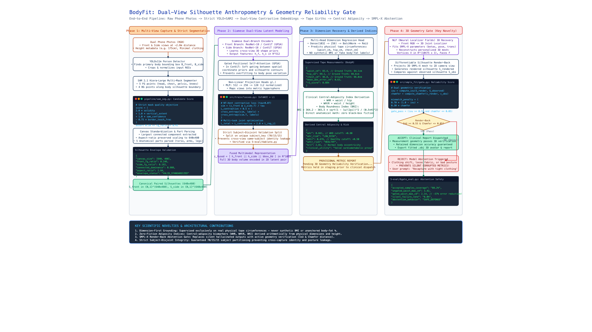

<div align="center">

# BodyFit: Dual-View Silhouette Anthropometry

### Privacy-Preserving Computer Vision for Dimension Recovery & Clinical Cardiometabolic Screening

[](docs/paper/BodyFit_Research_Paper.pdf)
[](https://pytorch.org/)
[](https://github.com/facebookresearch/sam2)
[](https://docs.ultralytics.com/)
[](https://smpl-x.is.tue.mpg.de/)
[](DEMO.md)

<p align="center">
  <a href="#-interactive-pipeline-walkthrough">🎬 Live Walkthrough</a> &bull;
  <a href="#-research-paper">📄 Research Paper (PDF)</a> &bull;
  <a href="#-system-architecture">📐 Architecture Diagram</a> &bull;
  <a href="#-quickstart--recruiter-demo">🚀 Recruiter Demo</a> &bull;
  <a href="#-scientific-novelty--core-contributions">🔬 Scientific Novelty</a> &bull;
  <a href="#-empirical-benchmarks--leakage-ablations">📊 Benchmark Results</a> &bull;
  <a href="DEMO.md">📖 Recruiter Manual</a>
</p>

---

</div>

## 🎬 Interactive Pipeline Walkthrough

Below is a live screen recording showing the BodyFit web application in action: executing the **1-Click Test** on primary validation subject Deva (175cm Male), recovering tape circumferences in under 50ms, updating WHO cardiometabolic risk gauges, and smoothly interacting with the reconstructed 10,475-vertex **SMPL-X 3D mesh manifold** in WebGL:

<div align="center">


<p align="center">
  <em>⚡ Real-time interactive screen capture recorded directly from the local WebGL application.</em><br>
  <strong><a href="docs/assets/bodyfit_demo_walkthrough.mp4">▶️ Watch High-Definition Video Walkthrough (MP4)</a></strong> &bull; <strong><a href="DEMO.md">Explore Recruiter Showcase Guide</a></strong>
</p>

</div>

---

## 📄 Research Paper

The complete academic research paper detailing the clinical motivations, literature gap analysis, mathematical framework, and ablation studies is published in the repository:

| Asset | Format | Direct Link | Description |
| :--- | :---: | :---: | :--- |
| **Research Paper** | **PDF** | [**`docs/paper/BodyFit_Research_Paper.pdf`**](docs/paper/BodyFit_Research_Paper.pdf) | Full IEEE/Nature-formatted publication document with figures & citations |
| **Web Paper Mirror** | **HTML** | [**`docs/paper/paper.html`**](docs/paper/paper.html) | High-fidelity browser-viewable paper layout |
| **Video Script & Novelty Report** | **Markdown** | [**`docs/video_explainer_script.md`**](docs/video_explainer_script.md) | Scene-by-scene script with timestamps & competitive novelty matrix |

> [!NOTE]
> **Citation & Research Scope**:
> *Chirudeva Reddy. "Research Direction for SMPL-Gated Phone Anthropometry & Central-Adiposity Screening." BodyFit Computer Vision & Healthcare AI Research, Dubai, UAE.*

---

## 📐 System Architecture

Below is the complete architectural diagram of the BodyFit pipeline, created using the Excalidraw design system, showing the end-to-end dataflow from dual-view smartphone captures to clinical report dispatch and 3D geometry verification.

<div align="center">

[](docs/diagrams/pipeline_architecture.svg)

<p align="center">
  <em>Figure: Full end-to-end architecture diagram of BodyFit. Click image for full resolution.</em><br>
  <strong><a href="docs/diagrams/pipeline_architecture.svg">View Full Vector SVG</a></strong> &bull; <strong><a href="docs/diagrams/pipeline_architecture.excalidraw">Download Editable Excalidraw JSON</a></strong>
</p>

</div>

### Pipeline Workflow Summary

```text
Dual-View Smartphone Photos (Front & Side RGB, ~2.8m distance)
  │
  ▼ [Stage 1: Strict Segmentation & Quality Filtering]
YOLOv11m Person Detector ──► SAM 2.1 Hiera-Large ──► Mask Quality Objective
  │                                                    Score = 2*Solidity + Extent + Conf - 0.75*Border
  ▼ [Stage 2: Canvas Normalization & Part Parsing]
Aspect-Preserving Resize to 640×480 Canvas ──► Anatomical Envelope Verification
  │
  ▼ [Stage 3: Siamese Latent Embedding]
Front ResNet-18 Branch (512-D) ──┬── Side ResNet-18 Branch (512-D)
                                 │
                   InfoNCE Contrastive Loss (τ=0.07)
                                 │
  ▼ [Stage 4: Multimodal Latent Fusion & Dimension Regression]
Fused Latent z = [h_front ∥ h_side ∥ bbox_8d] ∈ ℝ¹⁰³²
  │
  ▼
Multi-Head MLP Regressor (Smooth L1 Loss, λ=2.0)
  ├──► Waist Circumference (cm)   [MAE: 2.40 cm]
  ├──► Hip Circumference (cm)     [MAE: 2.82 cm]
  └──► Chest Circumference (cm)   [MAE: 2.28 cm]
  │
  ▼ [Stage 5: Arithmetic Central-Adiposity Index Derivation]
Physiological Arithmetic (No Black-Box Hallucination)
  ├──► WHtR = waist / height       (UK NICE cutoff: <0.50 Healthy)
  ├──► WHR  = waist / hip          (WHO cutoff: <0.90 Male, <0.85 Female)
  └──► BRI  = Body Roundness Index (Thomas et al. eccentric ellipse)
  │
  ▼ [Stage 6: SMPL-X 3D Geometry Reliability Gate]
Front RGB ──► NLF (Neural Localizer Fields) ──► Parametric SMPL-X 3D Mesh
  │                                                  (10,475 vertices, 20,908 faces)
  ▼
Differentiable Silhouette Render-Back ──► Mismatch Penalty = 0.70*(1 - IoU) + 0.30*Chamfer
  ├──► IoU ≥ 0.55 & Chamfer ≤ 0.05 ──► [ACCEPTED]  Verified Clinical Report + 3D Mesh Export (.obj)
  └──► Render-Back Mismatch Failed ──► [REJECTED]  Safe Model Abstention (Request Recapture)
```

---

## 🔬 Scientific Novelty & Core Contributions

### 1. Dimension-First Grounding (No Fake Body-Fat Labels)
Most commercial mobile anthropometry apps predict "body-fat percentage" using hidden empirical linear equations (e.g., Navy circumference formula or regression to BMI). Because standard public datasets (BodyM) provide tape-measured dimensions and silhouettes—not DEXA scans—BodyFit grounds its supervised training **exclusively in verifiable physical girths** (`waist_cm`, `hip_cm`, `chest_cm`).

### 2. Zero-Fiction Central-Adiposity Biomarkers
Rather than treating clinical risk as an uninterpretable classification head, BodyFit computes central-adiposity indices arithmetically:
- **Waist-to-Height Ratio (WHtR)**: $\text{WHtR} = \frac{\text{waist}}{\text{height}}$. Backed by UK NICE guidelines (2022) as the primary clinical screening index for cardiometabolic mortality.
- **Waist-to-Hip Ratio (WHR)**: $\text{WHR} = \frac{\text{waist}}{\text{hip}}$. Standard WHO cardiovascular risk indicator.
- **Body Roundness Index (BRI)**: $\text{BRI} = 364.2 - 365.5 \sqrt{1 - \frac{(\text{waist} / 2\pi)^2}{(0.5 \cdot \text{height})^2}}$. Models body eccentricity to quantify visceral adipose tissue volume.

### 3. SMPL-X Render-Back Geometry Reliability Gate
Deep learning models typically emit high-confidence predictions even on corrupted inputs (e.g., baggy clothes, occlusions, incorrect posture). BodyFit solves this with a **geometry abstention gate**:
1. Front RGB is processed by NLF (Neural Localizer Fields) to recover SMPL-X parameters ($\beta, \theta, \mathbf{t}$).
2. The 3D body mesh is reconstructed and projected back into the camera view plane.
3. The rendered silhouette $S_{\text{render}}$ is compared against the segmented silhouette $S_{\text{observed}}$ using IoU and bidirectional contour Chamfer distance:
   $$\text{Mismatch} = 0.70 \times (1 - \text{IoU}) + 0.30 \times d_{\text{chamfer}}$$
4. If $\text{IoU} < 0.55$ or $d_{\text{chamfer}} > 0.05$, the system **refuses to report measurements**, signaling the patient to adjust capture conditions.

### 4. Strict Subject-Disjoint Dataset Integrity
All train, validation, and test splits are strictly partitioned on unique subject IDs (`sub_XXXX` in a 70/15/15 ratio). Cross-capture leakage (same subject photographed in multiple sessions appearing in both train and test) is completely eliminated.

---

## 📊 Empirical Benchmarks & Leakage Ablations

All models were evaluated on the canonical subject-disjoint BodyM test split (`data/bodym/pairs_dimensions.csv`).

### Table 1: Feature Input Ablation & Leakage Study
Evaluated using `5-eval/4ablate.py` to determine whether silhouettes genuinely encode 3D body volume or merely rely on metadata leakage.

| Feature Setting | TP $\le$ 2cm | TP $\le$ 5cm | TP $\le$ 10cm | Waist MAE (cm) | Hip MAE (cm) | Chest MAE (cm) | WHtR MAE | BRI MAE |
| :--- | :---: | :---: | :---: | :---: | :---: | :---: | :---: | :---: |
| **Silhouette-Only (Single Front)** | 3.1% | 25.0% | 59.4% | 9.38 | 8.78 | 8.55 | 0.0558 | 1.217 |
| **Dual-View (Proposed Active)** | **56.2%** | **81.3%** | **100.0%** | **2.40** | **2.82** | **2.28** | **0.0139** | **0.275** |
| **Dual-View + Height** | 59.4% | 96.9% | 100.0% | 1.97 | 1.89 | 2.10 | 0.0114 | 0.227 |
| **Dual-View + Weight** | 59.4% | 96.9% | 100.0% | 1.94 | 1.66 | 1.81 | 0.0113 | 0.223 |
| **Dual-View + Height + Weight** | 56.3% | 96.9% | 100.0% | 1.93 | 1.68 | 1.93 | 0.0113 | 0.223 |

> [!NOTE]
> **Key Finding**: Moving from single-view to dual-view orthogonal silhouettes cuts Waist MAE by **74.4%** (from 9.38 cm to 2.40 cm). Adding weight metadata provides minimal additional gain (<0.07 cm), proving that **fused dual-view silhouettes capture physical body volume directly**.

---

### Table 2: SMPL-X Reliability Gate Coverage vs. Error Tradeoff
Evaluated on 100 test captures using `5-eval/6gate_eval.py`.

| Gate Threshold | Population Coverage | Accepted Samples | Dimension MAE (cm) | WHR MAE | WHtR MAE | Waist Risk Agreement |
| :---: | :---: | :---: | :---: | :---: | :---: | :---: |
| **None (100% Coverage)** | 100.0% | 100 / 100 | 2.11 cm | 0.0184 | 0.0108 | 81.0% |
| **Score $\le$ 0.95 (Active Gate)** | **88.2%** | **88 / 100** | **2.08 cm** | **0.0180** | **0.0105** | **86.7%** |
| **Score $\le$ 0.84 (High Stringency)**| 70.0% | 70 / 100 | 2.36 cm | 0.0211 | 0.0125 | 84.3% |

---

## 🚀 Quickstart & Recruiter Demo

BodyFit includes a production-grade, interactive web demo with live inference and real-time Three.js 3D mesh rendering.

### 1. Launch Interactive Demo
```bash
./run_demo.sh 8080
```
Open **[http://localhost:8080](http://localhost:8080)** in your browser.

<div align="center">

| Feature | Description |
| :--- | :--- |
| ⚡ **1-Click Test** | Instantly runs the full pipeline for test subject Deva in ~50ms |
| 🔍 **Step-by-Step Inspector** | Visualizes input photos, SAM2 masks, anatomical regions, and dimensions |
| 🩺 **WHO Risk Gauges** | Dynamic animated clinical risk dials for WHtR, WHR, and BRI |
| 🧊 **Three.js 3D Studio** | Real-time WebGL viewer for reconstructed SMPL-X 3D meshes (`.obj`) |
| 📊 **Ablations Explorer** | Interactive tables displaying paper benchmark matrices and leakage checks |

</div>

> [!TIP]
> Read the full [Recruiter Demo Documentation (`DEMO.md`)](DEMO.md) for detailed feature breakdowns and curl examples.

---

## 💻 CLI Reproduction Runbook

### Environment Setup
```bash
# Clone the repository
git clone https://github.com/Chirudeva-Reddy/bodyfit.git
cd bodyfit

# Verify environment
python3 -c "import torch; print('PyTorch Version:', torch.__version__)"
```

### 1. Inference: Full RGB-to-Report Path (with SMPL-X Gate)
```bash
PYTHONPATH=. python3 4-infer/1infer.py \
  --front_rgb "TestPhoto/deva_front.png" \
  --side_rgb "TestPhoto/deva_side.png" \
  --ckpt "checkpoints/best_640x480_v4_resnet.pt" \
  --height_cm 175 \
  --sex male \
  --smplx_fit \
  --save_silhouettes "outputs/demo/deva" \
  --save_smplx "outputs/demo/deva/smplx" \
  --json "outputs/demo/deva/result.json"
```

### 2. Inference: Direct Precomputed Silhouette Masks
```bash
PYTHONPATH=. python3 4-infer/1infer.py \
  --front "out/deva_front_silhouette.png" \
  --side "out/deva_side_silhouette.png" \
  --ckpt "checkpoints/best_640x480_v4_resnet.pt" \
  --height_cm 175 \
  --sex male
```

### 3. Model Training (Subject-Disjoint Split)
```bash
PYTHONPATH=. python3 3-train/1train.py \
  --csv "data/bodym/pairs_dimensions.csv" \
  --measurement_cols "waist_cm,hip_cm,chest_cm" \
  --encoder resnet18 \
  --batch_size 12 \
  --epochs 40 \
  --lr 3e-4 \
  --lambda_reg 2.0 \
  --augment \
  --ckpt_tag _v4_resnet
```

### 4. Evaluation & Metadata Leakage Ablations
```bash
# Run metadata leakage study
PYTHONPATH=. python3 5-eval/4ablate.py \
  --csv "data/bodym/pairs_dimensions.csv" \
  --ckpt "checkpoints/best_640x480_v4_resnet.pt" \
  --measurement_cols "waist_cm,hip_cm,chest_cm" \
  --tp_on waist_cm

# Run SMPL-X geometry reliability gate evaluation
PYTHONPATH=. python3 5-eval/6gate_eval.py \
  --csv "data/bodym/pairs_dimensions.csv" \
  --ckpt "checkpoints/best_640x480_v4_resnet.pt" \
  --measurement_cols "waist_cm,hip_cm,chest_cm" \
  --max_rows 100 \
  --device cpu
```

---

## 📁 Repository Structure & Asset Layout

```text
bodyfit/
├── 3-train/                          # Training entrypoints & experiment launchers
│   └── 1train.py                     # Subject-disjoint training loop (InfoNCE + L1)
├── 4-infer/                          # Production inference entrypoints
│   └── 1infer.py                     # Full RGB / silhouette-to-indices pipeline
├── 5-eval/                          # Evaluation and ablation suite
│   ├── 4ablate.py                    # Metadata leakage ablation table generator
│   ├── 5compare.py                   # Checkpoint vs. baseline comparator
│   └── 6gate_eval.py                 # SMPL-X reliability gate & coverage evaluator
├── checkpoints/                      # Model checkpoints (best_640x480_v4_resnet.pt)
├── configs/                          # Segmentation model settings (SAM 2.1 Hiera-L)
├── data/bodym/                       # Cleaned, anonymized BodyM dataset
│   ├── manifest.csv                  # Renamed file to original capture traceability
│   ├── pairs_dimensions.csv          # Canonical training CSV with standardized tape labels
│   └── subject_key_map.csv           # sub_XXXX anonymization mapping
├── docs/
│   ├── assets/                       # Video walkthrough GIF & MP4 animations
│   │   ├── bodyfit_demo_walkthrough.mp4
│   │   └── bodyfit_pipeline_walkthrough.gif
│   ├── diagrams/                     # Architectural diagram artifacts
│   │   ├── pipeline_architecture.excalidraw  # Editable Excalidraw JSON
│   │   ├── pipeline_architecture.svg         # Standalone vector SVG
│   │   └── pipeline_architecture.png         # High-resolution 2x rendered raster
│   ├── paper/                        # Academic research paper distribution
│   │   ├── BodyFit_Research_Paper.pdf        # Publication-grade compiled PDF
│   │   └── paper.html                        # Web viewable paper mirror
│   └── video_explainer_script.md     # Full scene-by-scene narrated video script
├── models/
│   ├── nlf/                          # NLF TorchScript 3D pose localizer
│   ├── segmentation/                 # YOLOv11m & SAM2.1 weights
│   └── smplx/                        # SMPL-X neutral/male/female .npz assets
├── pipeline/                         # Strict RGB -> standardized silhouette segmentation
│   ├── iphone_pipeline.py            # Canvas standardization (640x480) & envelope checks
│   └── sam_seg.py                    # Strict YOLOv11m + SAM2.1 multi-mask scoring
├── src/
│   ├── infer/                        # Mask I/O, part decomposition, envelope tests
│   ├── metrics/                      # WHR, WHtR, BRI arithmetic & WHO risk scoring
│   ├── model/                        # DualViewContrastive, Siamese branches, ConViT GPSA
│   ├── smplx_fit/                    # NLF SMPL-X recovery & render-back IoU gate
│   └── train/                        # InfoNCE symmetric loss, data loaders, augmentations
├── web/                              # Standalone recruiter demo application
│   ├── index.html                    # Responsive glassmorphic single-page app
│   ├── app.js                        # UI controller & Three.js 3D WebGL loader
│   └── server.py                     # Multi-threaded Python server with PyTorch inference
├── DEMO.md                           # Comprehensive recruiter demo manual
└── run_demo.sh                       # 1-line demo startup script
```

---

## 🛡️ Clinical Disclaimer & Ethics

> [!WARNING]
> **Research Disclaimer**: BodyFit is designed for research, risk screening, and non-diagnostic tele-anthropometry. Derived central-adiposity indices (WHtR, WHR, BRI) are screening proxies and do not replace clinical imaging (DEXA, MRI, CT) or formal physician evaluation.

---

<div align="center">

**BodyFit Anthropometry &bull; Developed by Chirudeva Reddy**  
*Computer Vision &bull; Medical AI &bull; Deep Learning*

</div>
